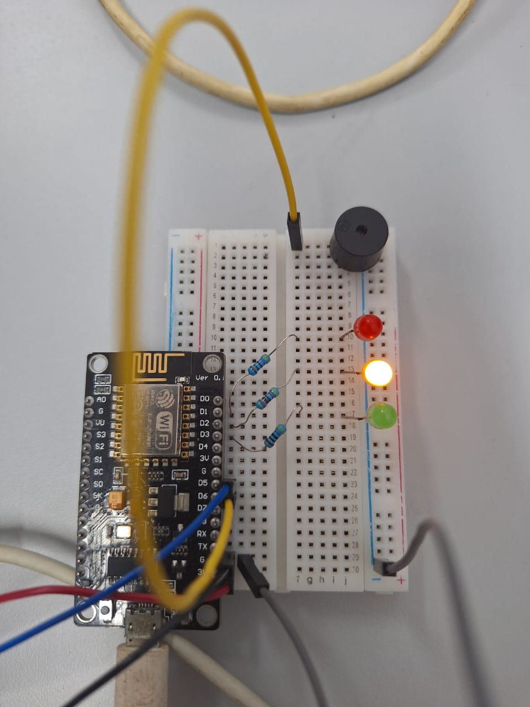

# POSTTEST 3 - PRAKTIUM IOT - UNMUL

Kelompok 1 B 2021 :
- 2109106056 Ahmad Dhiya Ulhaqi
- 2109106078 Rian Syaputra Ainun Naim
- 2109106105 Rhesa Binsar Jeremiah Simbolon

## Project IOT menggunakan ThingSpeak dan website untuk monitoring suhu

Perangkat ini dibuat untuk memonitor suhu ruangan dengan 3 lampu LED, 1 piezzo buzzer, dan 1 dht11 sensor.

**Cara Kerja Alat :**
- Rangkaian alat disipakan dengan mikrokontroler ESP8266, 3 lampu LED, 1 piezzo buzzer, dan 1 dht11 sensor.
- DHT 11 berfungsi sebagai sensor suhu dan kelembapan untuk membaca suhu ruangan.
- Informasi suhu akan diproses dalam algoritma pemrograman untuk menyalakan lampu dan juga piezzo buzzer
- Apabila suhu ruangan berada dibawah 30 °C maka lampu berwarna hijau akan menyala.
- Apabila suhu ruangan berada diantara 30 °C sampai 36 °C maka LED yang menyala adalah yang berwarna kuning untuk menunjukkan suhu dalam keadaan yang wajar.
- Apabila suhu ruangan berada diatas 36 °C maka lampu berwarna merah yang akan menyala diiring dengan bunyi piezzo buzzer, menandakan suhu yang tinggi.
- Informasi suhu akan dicatan dan dikirimkan menuju server atau dashboard ThingSpeak .
- Untuk memonitoring suhu, sebuah website sederhana dibuat dengan mengambil data dari API ThingSpeak.
- Data yang ditampilkan pada website adalah suhu ruangan dalam satuan derajat celcius, fahrenheit, dan kelvin.

**Ketentuan :**
- Apabila suhu ruangan berada dibawah 30 °C maka lampu berwarna hijau akan menyala.
- Apabila suhu ruangan berada diantara 30 °C sampai 36 °C maka LED yang menyala adalah yang berwarna kuning untuk menunjukkan suhu dalam keadaan yang wajar.
- Apabila suhu ruangan berada diatas 36 °C maka lampu berwarna merah yang akan menyala diiring dengan bunyi piezzo buzzer, menandakan suhu yang tinggi.
- Data suhu ruangan dalam satuan derajat celcius, fahrenheit, dan kelvin.

**Pembagian Tugas :**
- 2109106056 : Coding Web, Github, Pengiriman data ke Thingspeak.
- 2109106078 : Coding fungsional LED, DHT11 , Piezzo Buzzer, dan akun thingspeak.
- 2109106105 : Perakitan.

**Komponen :**
- BreadBoard
- Resistor
- Kabel male to male
- NodeMCU esp8266
- Lampu LED
- Piezzo Buzzer
- DHT 11
- Kabel Micro USB

**Rangkaian :**

